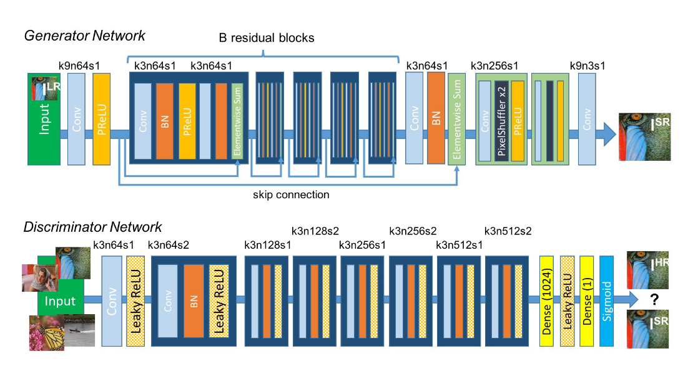
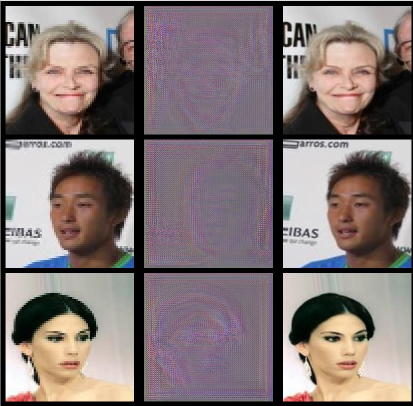
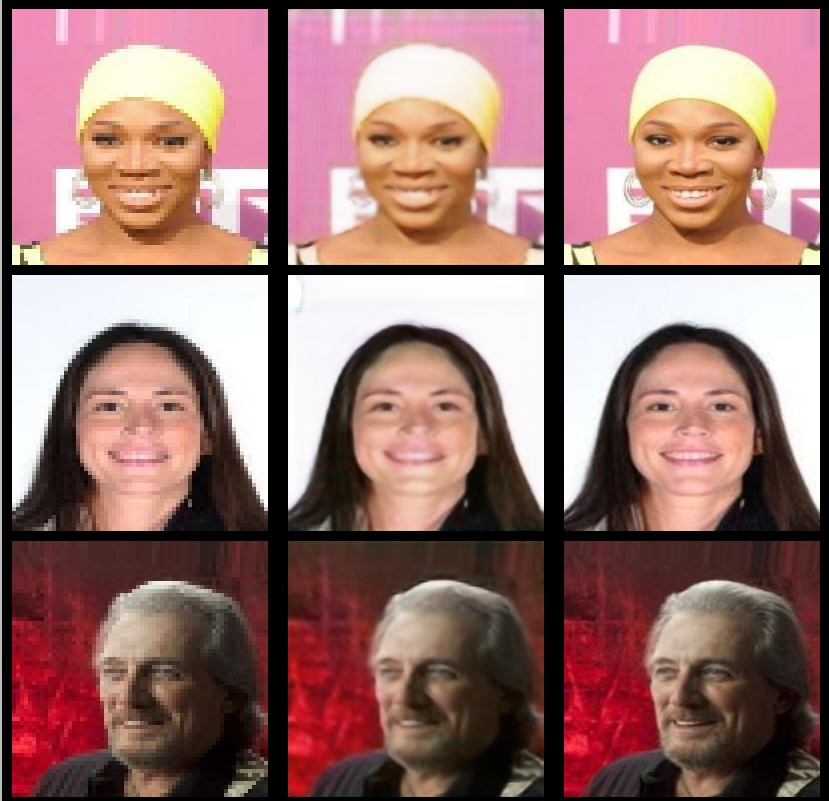

# SRGAN
This is an implementation of the paper (Photo-Realistic Single Image Super-Resolution Using a Generative 
AdversarialNetwork) based on pytroch


# super resolution generative adversarial network
<p align="center"> 
  
  <h3 align="center">
    A python inplementation of SRGAN based on pytorch 
  </h3>  
</p>

---
---
# abstract (papper)

Despite  the  breakthroughs  in  accuracy  and  speed  ofsingle image super-resolution using faster and deeper con-volutional  neural  networks,  one  central  problem  remainslargely unsolved: how do we recover the finer texture detailswhen  we  super-resolve  at  large  upscaling  factors?    Thebehavior of optimization-based super-resolution methods isprincipally driven by the choice of the objective function.Recent work has largely focused on minimizing the meansquared reconstruction error.  The resulting estimates havehigh peak signal-to-noise ratios, but they are often lackinghigh-frequency details and are perceptually unsatisfying inthe  sense  that  they  fail  to  match  the  fidelity  expected  atthe  higher  resolution.   In  this  paper,  we  present  SRGAN,a generative adversarial network (GAN) for image super-resolution (SR). To our knowledge, it is the first frameworkcapable of inferring photo-realistic natural images for4×upscaling factors. To achieve this, we propose a perceptualloss  function  which  consists  of  an  adversarial  loss  and  acontent loss.   The adversarial loss pushes our solution tothe natural image manifold using a discriminator networkthat is  trained  to differentiate between the  super-resolvedimages and original photo-realistic images. In addition, weuse a content loss motivated by perceptual similarity insteadof  similarity  in  pixel  space.   Our  deep  residual  networkis  able  to  recover  photo-realistic  textures  from  heavilydownsampled images on public benchmarks.  An extensivemean-opinion-score  (MOS)  test  shows  hugely  significantgains in perceptual quality using SRGAN. The MOS scoresobtained  with  SRGAN  are  closer  to  those  of  the  originalhigh-resolution  images  than  to  those  obtained  with  anystate-of-the-art method


# contents
* [structure](#structure)
* [results](#results)
* [prerequisites](#prerequisites)
* [installation](#installation)
* [training](#training)
* [prediction](#searching)


# structure
This project is structured in a modular way
It contains the :
* following directories:
    * modelization
        * definition of generator structure 
        * definition of discriminator structure
    * libraries
    	* group a set of functionalies such as
    	* image procesing 
    	* path manipulation   
    * readme_utils
        * contains some image, font for readme rendering 
        * can be easily extended by the user 
* following files
		* dataset.py
		* learning.py
		* predict.py
        * .gitignore
        * requirements.txt 

# results

<p align="center"> 
  
  <h3 align="center">
    generator output epoch N°1 
  </h3>  
</p>


<p align="center"> 
  
  <h3 align="center">
    generator output epoch N°50 
  </h3>  
</p>

# prerequisites
* git
* curl
* cmake 
* pkg-config 
* libatlas-base-dev 
* libboost-python-dev 
* libopenblas-dev 
* liblapack-dev
* python3
* python3-venv 
* build-essential 

# installation 
```bash
	git clone https://github.com/Milkymap/SRGAN
	cd SRGAN
	python -m venv env 
	source env/bin/activate
	pip install -r requirements.txt
```


# training

## ...........single gpu...........

```python
	python -m learning single-gpu 
		--gpu_idx 0 
		--source_path path_to_dataset 
		--nb_epochs 100 
		--bt_size 4
		--path_to_dump dump 

```

## ...........multiple gpu...........

```python
	python -m learning multiple-gpu 
		--nb_nodes 1
		--nb_gpus 8
		--currant_rank 0
		--server_config tcp://localhost:8000
		--source_path path_to_dataset 
		--nb_epochs 100 
		--bt_size 4
		--path_to_dump dump 
```


# prediction (upscale [4x] input image)
```python
	python predict.py 
		--source path_to_low_resolution_images.(jpg, jpeg) 
		--generator generator.network.pt 
```
